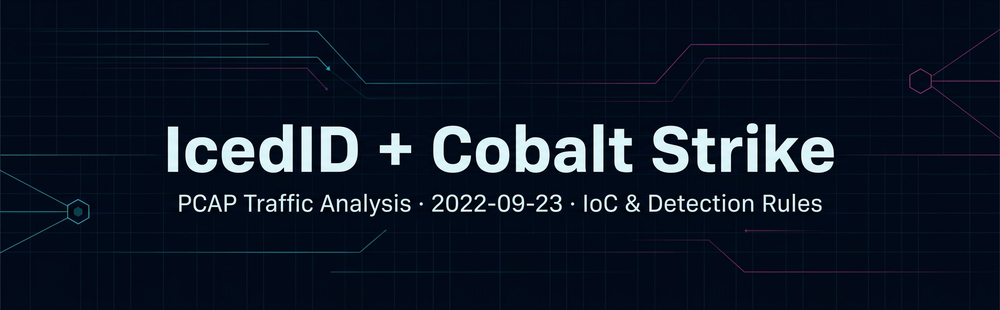
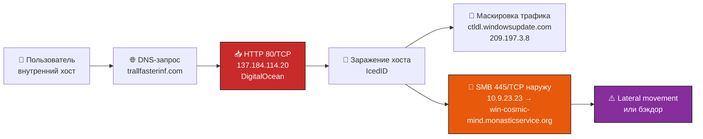

<div align="center">



# Анализ сетевого дампа: IcedID + Cobalt Strike

**Разбор PCAP `2022-09-23-IcedID-infection-with-Cobalt-Strike` с площадки [malware-traffic-analysis.net](https://www.malware-traffic-analysis.net/)**
Извлечение индикаторов компрометации, атрибуция C2, анализ аномалий SMB и готовые правила детекта.

[](docs/report.md)
[](docs/report.md)
[](ioc/)
[](rules/)
[](https://www.first.org/tlp/)
[](LICENSE)

[Отчёт](docs/report.md) · [Индикаторы](ioc/) · [Правила детекта](rules/) · [Методология](docs/methodology.md) · [Веб-версия](docs/index.html)

</div>

---

## 📌 Кратко (TL;DR)

> Учебный разбор заражённого хоста. В трафике обнаружен подтверждённый фишинговый домен, обращения к нему по HTTP, а также **исходящий SMB-трафик (445/TCP) на внешний домен** — критический признак горизонтального перемещения или бэкдора.

| | |
|---|---|
| **Дамп** | `2022-09-23-IcedID-infection-with-Cobalt-Strike.pcap` |
| **Дата извлечения IoC** | 2026-03-26 |
| **Аналитик** | DeqUser |
| **Инструменты** | Wireshark, VirusTotal |
| **Ключевая находка** | Исходящий SMB (445/TCP) от `10.9.23.23` на внешний домен |
| **Уровень риска** | 🔴 Высокий |
| **Классификация** | TLP:CLEAR |

---

## 🧭 Цепочка событий



---

## 🔎 Индикаторы компрометации

### Домены

| Домен | Роль | VirusTotal | Вердикт |
|---|---|:--:|---|
| `trallfasterinf.com` | Фишинг / доставка | **10 / 92** | 🔴 Вредоносный |
| `win-cosmic-mind.monasticservice.org` | SMB-аномалия (445/TCP) | 0 / 92 | 🟠 Подозрительный |
| `ctldl.windowsupdate.com` | Легитимный Microsoft CTL | 0 / 92 | 🟡 Требует проверки |

### IP-адреса

| IP | Порт | Принадлежность | Вердикт |
|---|:--:|---|---|
| `137.184.114.20` | 80/TCP | DigitalOcean (хостинг фишинга) | 🔴 Вредоносный |
| `209.197.3.8` | 80/TCP | Microsoft | 🟡 Легитимный, но частота запросов подозрительна |
| `10.9.23.23` | 445/TCP | Внутренний хост (RFC1918) | 🟠 Скомпрометирован |

### Порты

| Порт | Протокол | Почему в списке |
|:--:|---|---|
| `80` | HTTP | Связь с фишинговым доменом `trallfasterinf.com` |
| `445` | SMB | **Исходящий** SMB наружу — почти всегда признак атаки |

📦 Машиночитаемые форматы: [`ioc/iocs.csv`](ioc/iocs.csv) · [`ioc/iocs.json`](ioc/iocs.json) · [`ioc/blocklist.txt`](ioc/blocklist.txt)

---

## 🛡 Рекомендации

| # | Действие | Приоритет |
|:--:|---|:--:|
| 1 | Заблокировать `trallfasterinf.com` и `137.184.114.20` на всех сетевых уровнях | 🔴 Немедленно |
| 2 | Заблокировать `win-cosmic-mind.monasticservice.org` и исходящий 445/TCP от `10.9.23.23` | 🔴 Немедленно |
| 3 | Изолировать и проверить хост `10.9.23.23` на наличие ВПО | 🔴 Немедленно |
| 4 | Настроить постоянный мониторинг исходящего SMB (445/TCP) на внешние адреса | 🟠 Высокий |
| 5 | Проверить частоту обращений к `ctldl.windowsupdate.com` на предмет маскировки | 🟡 Средний |

Готовые правила: [`rules/suricata.rules`](rules/suricata.rules) · [`rules/sigma/`](rules/sigma)

---

## 📂 Структура репозитория

```
.
├── README.md                  ← вы здесь: сводка и ключевые выводы
├── assets/
│   └── banner.png             обложка проекта
├── docs/
│   ├── report.md              полный отчёт по анализу
│   ├── methodology.md         методология и команды Wireshark/tshark
│   └── index.html             веб-версия отчёта (GitHub Pages)
├── ioc/
│   ├── iocs.csv               индикаторы в CSV
│   ├── iocs.json              индикаторы в JSON (MISP-совместимая структура)
│   └── blocklist.txt          плоский список для блокировки
├── rules/
│   ├── suricata.rules         сетевые сигнатуры (Suricata/Snort)
│   └── sigma/                 правила Sigma для SIEM
├── ci/                        готовые GitHub Actions (валидация IoC + Pages)
├── CONTRIBUTING.md
├── SECURITY.md
└── LICENSE
```

---

## 🚀 Как пользоваться

```bash
# 1. Блокировка доменов и IP из плоского списка
cat ioc/blocklist.txt

# 2. Подключение сигнатур Suricata
sudo cp rules/suricata.rules /etc/suricata/rules/icedid-2022-09-23.rules
sudo suricata -T -c /etc/suricata/suricata.yaml   # проверка конфигурации

# 3. Быстрая проверка собственного дампа на эти индикаторы
tshark -r capture.pcap -Y 'dns.qry.name contains "trallfasterinf"'
tshark -r capture.pcap -Y 'tcp.dstport == 445 && !(ip.dst == 10.0.0.0/8)'
```

---

<details>
<summary><b>🇬🇧 English summary</b></summary>

<br>

Network traffic analysis of the `2022-09-23-IcedID-infection-with-Cobalt-Strike` capture from malware-traffic-analysis.net.

**Key findings**

- `trallfasterinf.com` (`137.184.114.20`, DigitalOcean, 80/TCP) — phishing/delivery domain, flagged by 10/92 VirusTotal engines.
- `win-cosmic-mind.monasticservice.org` — contacted over **445/TCP (SMB) from internal host `10.9.23.23`**. Outbound SMB to an external domain is a strong indicator of lateral movement or a backdoor.
- `ctldl.windowsupdate.com` (`209.197.3.8`) — legitimate Microsoft CTL endpoint, but request frequency should be reviewed as possible blending/masquerading traffic.

**Deliverables** — machine-readable IoCs (CSV/JSON/blocklist), Suricata signatures and Sigma rules, full methodology write-up.

</details>

<details>
<summary><b>⚠️ Дисклеймер и ограничения анализа</b></summary>

<br>

- Репозиторий носит **исключительно образовательный и исследовательский характер**. Он не содержит вредоносных файлов и самого PCAP — только результаты анализа.
- Точная длительность записи и общее число пакетов/потоков в рамках данного разбора не фиксировались, поэтому выводы о масштабе атаки не делаются.
- Отсутствие детектов в VirusTotal не является доказательством безопасности индикатора, особенно в сочетании с аномальным использованием портов.
- Индикаторы актуальны на дату извлечения (2026-03-26) и со временем могут терять релевантность.

</details>

---

<div align="center">

**Аналитик:** DeqUser · **Лицензия:** [MIT](LICENSE) · **Классификация:** TLP:CLEAR

⭐ Если материал оказался полезен — поставьте звезду репозиторию

</div>
